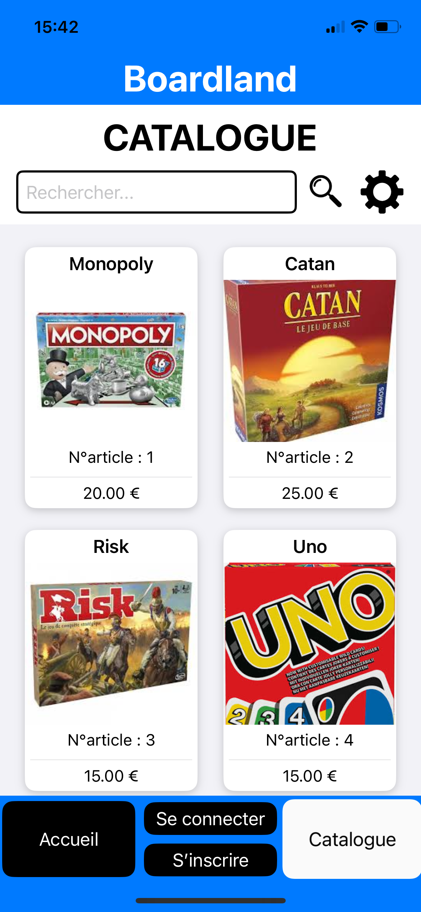
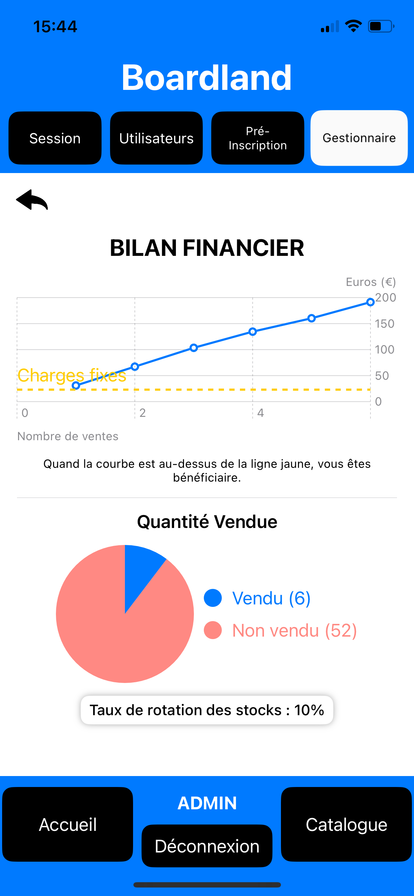
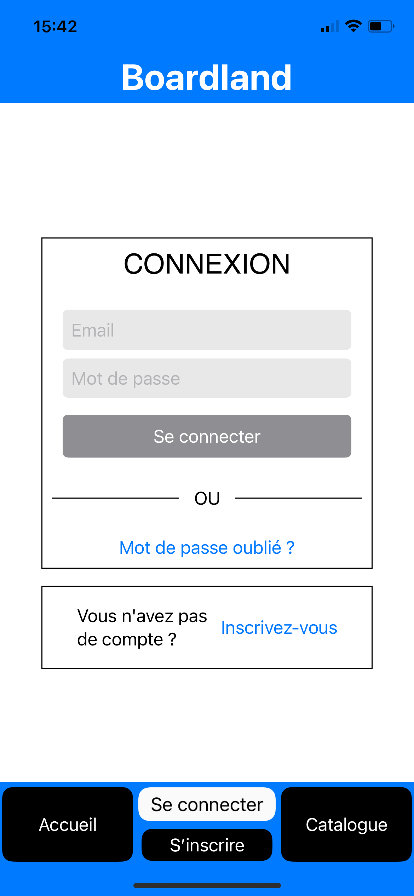
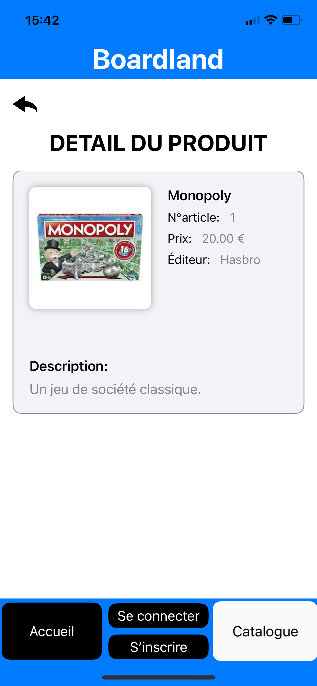

# BOARDLAND - APPLICATIO IOS POUR FESTIVAL DE JEUX

|  | 
 <strong>RESUME</strong>  
BoardLand est une plateforme innovante conçue pour simplifier l'organisation des festivals de jeux de société. Ensemble avec un ami, nous avons développé cette solution afin d’optimiser la gestion des ventes, des dépôts et des finances, tout en garantissant une sécurité renforcée.

 |
| --- | --- |

## Fonctionnalités

- **Visiteur (non connecté)** : Accès limité au catalogue des jeux disponibles.
- **Vendeur** : Visualisation du récapitulatif financier personnel et des rapports de vente.
- **Manager** :
  - Dépôt de jeux avec génération d’un identifiant unique et étiquetage automatique.
  - Retrait des jeux en consultant l’historique par email.
  - Mise en vente des jeux sélectionnés.
  - Enregistrement des achats par identifiant de produit.
  - Génération de bilans financiers pour un festival ou un utilisateur.
- **Administrateur** :
  - Création et modification de sessions de dépôt liées aux festivals.
  - Gestion complète des comptes utilisateurs (modification, suppression, etc.).
  - Préinscription des utilisateurs avec affectation automatique de rôles.

## Technologies Utilisées

- **Base de données** : MySQL (phpMyAdmin)
- **Front-End** : Angular
- **Back-End** : Node.js
- **Hébergement** : Raspberry Pi avec Apache2 (possibilité de n’héberger que la dernière version pour des raisons de performance)

## Sécurité

- **Protections au niveau du code** : Sécurité CORS, protection contre les injections SQL, prévention des failles XSS.
- **Mesures de sécurité visibles** : Vérification par email (code de confirmation lors de l’inscription), connexion sécurisée via HTTPS, et accès restreint aux pages non autorisées.

## Aperçu des Images

  
  
  

## Structure du Projet

Le projet est organisé en deux grandes parties :

- **FRONT** : 
  - Contient l’interface mobile développée en Swift via Xcode.
  - Dossier `IMAGE_README` regroupant les visuels de présentation.
- **BACK** :
  - Regroupe le backend Node.js et la gestion des routes de l’application.

## Installation et Démarrage

1. **Cloner le dépôt :**  
   `git clone <url_du_dépôt>`
2. **Installer les dépendances pour le BACK :**  
 `npm install express express-session nodemailer body-parser axios mysql path uuid cors fs https`
3. **Configurer la base de données :**  
   Modifier les paramètres de connexion dans le fichier de configuration.
4. **Lancer l’application :**  
   Démarrer le serveur back-end et build ton projet Xcode avec le FRONT.

Placez-vous dans le dossier BACK puis exécutez :

## Contact

Pour toute question ou suggestion, veuillez contacter [Barbedet] à l'adresse [barbedetanthony@gmail.com].

---

🚀 **BoardLand** : Simplifiez l’organisation de vos festivals de jeux de société !
